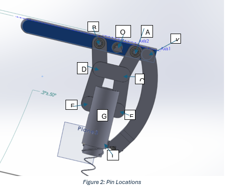
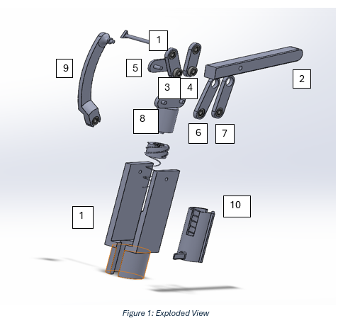
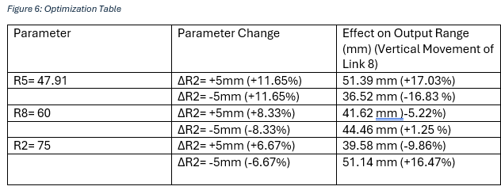
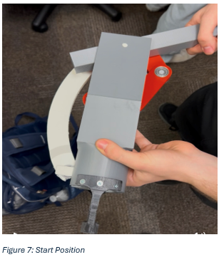

## Please click on the Kyn and Dyn Report file to view the project report which contains all the technical details of the design as well as full array of pictures of the design process.

*Cad Model showing pin locations*

*Cad Model In Exploded View showing 10 Links*

*Table showing optimization table of different link lengths and the effect on range of motion*

*Printed Prototype of the Mechanism*
